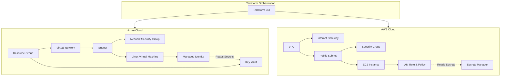

# Secure Multi-Cloud Infrastructure using Terraform

This repository contains a Terraform project that provisions a secure, multi-cloud infrastructure across both Azure and AWS. It demonstrates the use of modular Terraform code to deploy networking, compute, and security resources in two major public cloud providers simultaneously.

## Architecture



The infrastructure consists of two main modules:

### AWS Infrastructure
- **VPC & Subnets**: A Virtual Private Cloud (VPC) with a public subnet in `us-east-1` (configurable).
- **Compute**: An EC2 instance (Ubuntu 22.04 LTS) launched within the public subnet.
- **Security**: 
  - A Security Group allowing SSH (port 22) and outbound traffic.
  - IAM Roles and Policies attached via an Instance Profile to grant the EC2 instance read access to AWS Secrets Manager.
- **Secrets Management**: AWS Secrets Manager is used to securely store and provide access to a database secret.

### Azure Infrastructure
- **Networking**: A Virtual Network (VNET) and Subnet within a Resource Group.
- **Compute**: A Linux Virtual Machine (Ubuntu 22.04 LTS) provisioned with a dynamic Public IP and Network Interface. SSH keys are generated automatically via the `tls_private_key` resource.
- **Security**: 
  - Network Security Group (NSG) associated with the subnet to allow inbound SSH traffic.
  - System-Assigned Managed Identity enabled on the VM.
- **Secrets Management**: Azure Key Vault is provisioned with access policies granting the Terraform executor full control and granting the VM's Managed Identity read/list permissions to retrieve secrets.

## Prerequisites

- [Terraform](https://developer.hashicorp.com/terraform/downloads) (>= 1.5.0)
- Active **AWS Account** and credentials configured (e.g., via `aws configure` or environment variables `AWS_ACCESS_KEY_ID` / `AWS_SECRET_ACCESS_KEY`).
- Active **Azure Account** and credentials configured (e.g., via `az login` or environment variables for Service Principal).

## Quick Start

1. **Clone the repository** (or navigate to this directory).
2. **Initialize Terraform**:
   ```bash
   terraform init
   ```
   This will download the required AWS and Azure providers.

3. **Format and Validate**:
   ```bash
   terraform fmt -recursive
   terraform validate
   ```

4. **Review the Plan**:
   ```bash
   terraform plan
   ```
   Check the output to ensure the expected resources will be created.

5. **Deploy the Infrastructure**:
   ```bash
   terraform apply
   ```
   *Note: This will provision billable resources in your AWS and Azure accounts.*

## Outputs

After a successful `terraform apply`, you will receive several outputs:

- `aws_infrastructure.ec2_public_ip`: The public IP of the AWS EC2 instance.
- `aws_infrastructure.secret_arn`: The ARN of the secret in AWS Secrets Manager.
- `azure_infrastructure.vm_public_ip`: The public IP of the Azure VM.
- `azure_infrastructure.key_vault_uri`: The URI of the Azure Key Vault.
- `azure_infrastructure.private_key`: The sensitive RSA private key required to SSH into the Azure VM. (Use `terraform output -raw private_key > id_rsa` to save it).

## Customization

You can customize the deployment by passing variables either via a `terraform.tfvars` file or command-line arguments:

- `project_name` (default: `"secure-multicloud"`): Prefix used for all resources.
- `environment` (default: `"dev"`): Environment name (e.g., dev, staging, prod).
- `aws_region` (default: `"us-east-1"`): Target AWS region.
- `azure_location` (default: `"East US"`): Target Azure region.

## Cleanup

To avoid incurring ongoing charges, remember to destroy the infrastructure when you are done testing:

```bash
terraform destroy
```
